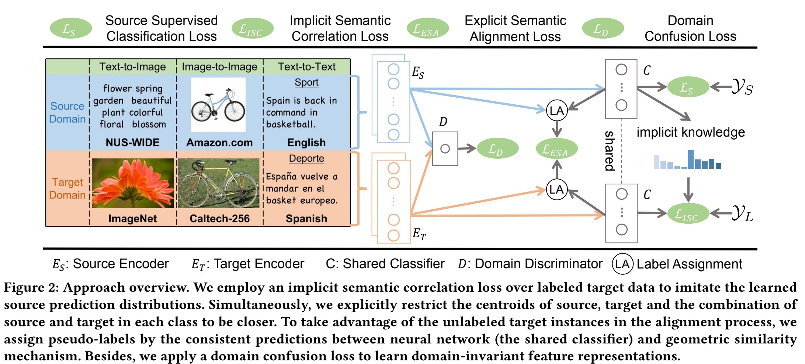

# Simultaneous Semantic Alignment Network for Heterogeneous Domain Adaptation
This is a [pytorch](http://pytorch.org/) implementation of [SSAN](https://arxiv.org/abs/2008.01677).

### Paper



[Simultaneous Semantic Alignment Network for Heterogeneous Domain Adaptation ](https://arxiv.org/abs/2008.01677) 

[Shuang Li](http://shuangli.xyz), [Binhui Xie](https://binhuixie.github.io), [Jiashu Wu](https://jiashuwu.github.io), Ying Zhao, [Chi Harold Liu](http://cs.bit.edu.cn/szdw/jsml/js/lc_20180927062826951290/index.htm), [Zhengming Ding](http://allanding.net)

*ACM International Conference on Multimedia*, 2020

### Abstract
Heterogeneous domain adaptation (HDA) transfers knowledge across source and target domains that present heterogeneities e.g., distinct domain distributions and difference in feature type or dimension. Most previous HDA methods tackle this problem through learning a domain-invariant feature subspace to reduce the discrepancy between domains. However, the intrinsic semantic properties contained in data are under-explored in such alignment strategy, which is also indispensable to achieve promising adaptability. In this paper, we propose a Simultaneous Semantic Alignment Network (SSAN) to simultaneously exploit correlations among categories and align the centroids for each category across domains. In particular, we propose an implicit semantic correlation loss to transfer the correlation knowledge of source categorical prediction distributions to target domain. Meanwhile, by leveraging target pseudo-labels, a robust triplet-centroid alignment mechanism is explicitly applied to align feature representations for each category. Notably, a pseudo-label refinement procedure with geometric similarity involved is introduced to enhance the target pseudo-label assignment accuracy. Comprehensive experiments on various HDA tasks across text-to-image, image-to-image and text-to-text successfully validate the superiority of our SSAN against state-of-the-art HDA methods.

### Prerequisites
- Python 3.6
- Pytorch 1.3.1
- numpy
- scipy
- matplotlib
- scikit_learn
- CUDA >= 8.0
### Step-by-step installation

```bash
$ conda create -n ssan -y python=3.6
$ conda activate ssan

# this installs the right pip and dependencies for the fresh python
$ conda install -y ipython pip

# to install the required python packages, run
$ pip install -r requirements.txt
```


### Getting started

All datasets can be downloaded [here](https://github.com/BIT-DA/SSAN/releases) and put in <root_dir>/datasets


### Train and Evaluate
```
Image-To-Image
$ python main.py --source amazon_surf --target amazon_decaf --cuda 0 --nepoch 3000 --partition 20 --prototype three --layer double --d_common 256 --optimizer mSGD --lr 0.1 --alpha 0.1 --beta 0.004 --gamma 0.1 --combine_pred Cosine --checkpoint_path checkpoint/ --temperature 5.0
```


### Acknowledgements

Especially thanks to [Yuan Yao](https://www.researchgate.net/profile/Yuan_Yao67)  for helping experiments


### Citation
If you find this code useful for your research, please cite our [paper](https://arxiv.org/abs/2008.01677):
```
@inproceedings{li2020simultaneous,
    title = {Simultaneous Semantic Alignment Network for Heterogeneous Domain Adaptation},
    author = {Li, Shuang and Xie, Binhui and Wu, Jiashu and Zhao, Ying and Liu, Chi Harold and Ding, Zhengming},
    booktitle = {28th ACM International Conference on Multimedia (MM'20))},    
    year = {2020}
}
```

### Contact

If you have any problem about our code, feel free to contact
- shuangli@bit.edu.cn
- binhuixie@bit.edu.cn

or describe your problem in Issues.
